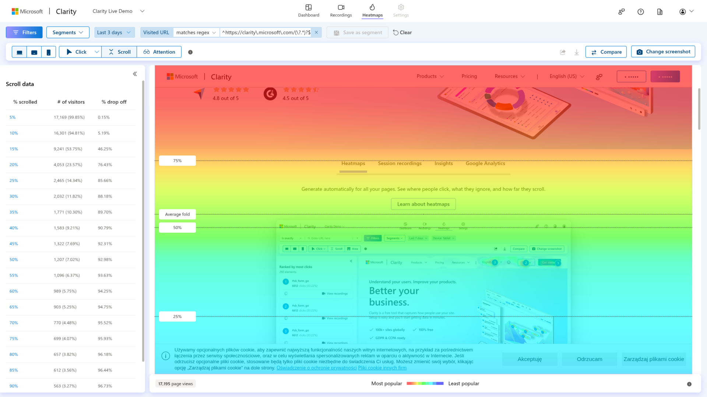
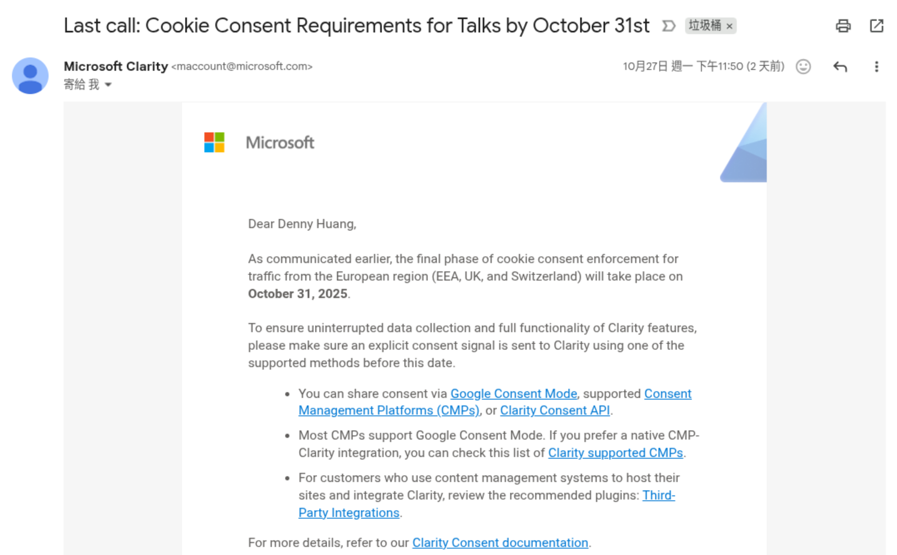
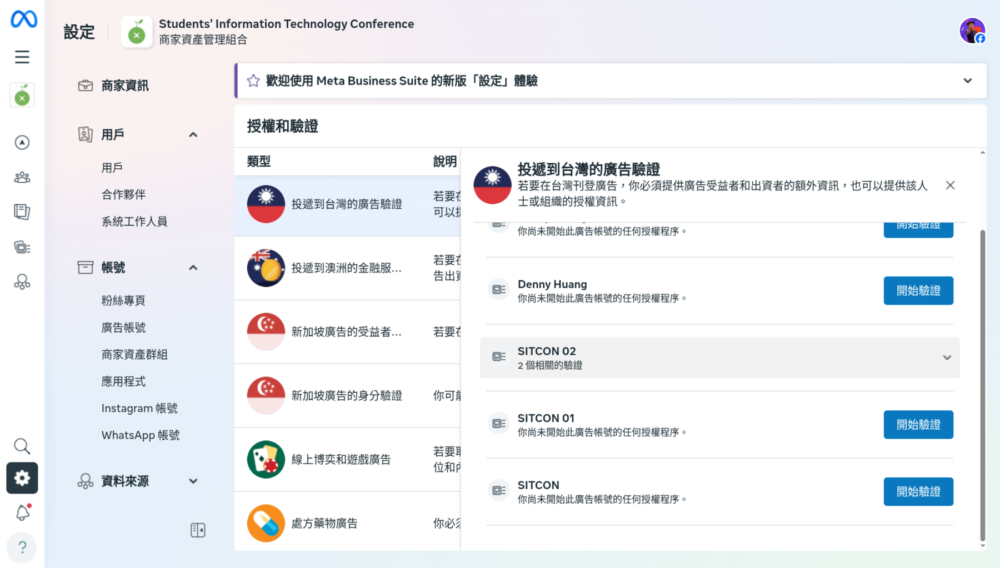
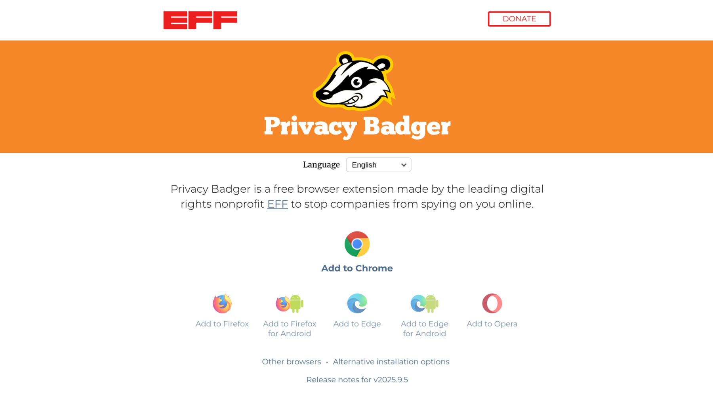

<!-- Google tag (gtag.js) -->

<!-- _paginate: false -->

# 2024 年度 TWNIC 網路計畫
## 自律或他律？ 網路平臺內容審核機制之法制研究與技術革新
## 圓桌論壇

 
 

## Denny Huang
### 2025/10/29

---

# [https://denny.one/20251029-TWNIC-Grants-2024-platform-govern](https://denny.one/20251029-TWNIC-Grants-2024-platform-govern)

---

# Denny Huang

- <a href="https://sitcon.org/" target="_blank">SITCON 學生計算機年會</a> 共同發起人
- 曾任雷亞遊戲（Rayark Inc.） 資料分析團隊主管
- 開放原始碼/資訊安全社群活躍參與者
- <a href="https://denny.one/" target="_blank">About me</a>

---

# 從隱私保護談起

---

# Microsoft Clarity
<video src="./img/clarity.mp4" width="90%" controls autoplay loop muted></video>

---

# Microsoft Clarity

---

# Microsoft Clarity

---

# Microsoft Clarity

---

# 他律的效果

---

# 他律的效果

---

# 民間自立自強
## EFF 電子前哨基金會 - Privacy Badger

---

# 商業公司追求的目標
- 獲利最大化
- 使用者增長
- 使用者留存
- 使用者體驗
- 品牌形象維護
- 法規遵循
- 風險管理

---

# 為什麼要自律？
- 提供更好的使用者體驗
- 降低法規風險
- 維護品牌形象
- 預防政府過度干預

---

### 一、跨國巨型平臺如何在遵守當地法規的同時實行平臺自訂規範執行內容篩選審核機制？
- 如何平衡全球一致性與在地化需求？
- 怎麼提升用戶信任與滿意度？
- 平台也需要法律依據來支持其內容審核決策
- 跨國平臺在內容審核中也將面臨的文化差異與價值觀衝突

---

# 案例 - Sdorica 萬象物語

國際版本 | 修改版本
:-----|:------
 | 
 | 

---

# 案例 - Sdorica 萬象物語

國際版本 | 修改版本
:-----|:------
 | 
 | 

---

### 二、依您之見，「平臺自律」與「政府他律」的監管政策之價值選擇的利弊得失為何，以及兩者是否存在雙軌並行的可能
- 平臺自律的優勢在於靈活性與專業性，但可能缺乏透明度與問責性
- 政府他律則能提供法律保障與公共利益，但可能導致過度監管與創新受限
- 雙軌並行勢在必行

---

### 三、平臺確定違規行為及審核決策之內容審核機制之運作現況為何？現行採用之內容審核及演算法驅動之自動化決策在偵測違規行為中的準確性與公正性為何？是否應設置獨立第三方審核機構來處理用戶申訴，從而強化對平台決策的外部監督？
- 內容審核機制通常結合人工審核與自動化工具
- 自動化工具在偵測違規行為上有一定的準確性，但仍存在誤判與偏見問題
- 獨立第三方審核機構能提升透明度與公正性，但也需考慮其運作成本與效率
- 需建立申訴機制，讓用戶能夠有效表達意見與尋求救濟
- 透明化審核標準與流程，增加使用者信任度
- 定期發布審核報告，接受外部監督與評估
- 引入多元化的審核團隊，減少偏見與誤判
- 平台大小、獲利模式皆會影響其內容審核機制的設計與運作

---

### 四、跨國平臺管控線上言論之影響力日益加劇，各界倡導之多方利害關係人治理、敏捷式治理模式如何導入平臺企業執行面？科技社群與公民團體能發揮何種規範形塑與制度形成的驅力？

#### 如何導入
- 由上而下的政策制定與執行
- 幫助企業獲利的有效案例分享

#### 科技社群與公民團體
- 使用者教育與素養提升，增強其對網路內容的辨識能力與參與意識
- 監督與倡議，促使平台遵守道德標準與公共利益

---

# 延伸閱讀
## SITCON 學生計算機年會 2025 議程

[因為反抗，所以存在：監控資本主義下的自由如何可能？](https://sitcon.org/2025/agenda/90352d/)

# 案例圖片引用自
- [【討論】龍淵服的神奇操作 @Sdorica 萬象物語 哈啦板 - 巴哈姆特](https://forum.gamer.com.tw/C.php?bsn=29560&snA=6736)
- [角色一览 - 万象物语WIKI BWIKI_哔哩哔哩](https://wiki.biligame.com/wanxiang/%E8%A7%92%E8%89%B2%E4%B8%80%E8%A7%88)

---

# Thanks for listening

 
 

###### 本投影片採用
 <a href="https://creativecommons.org/licenses/by-sa/4.0/deed.zh-hant" target="_blank">創用 CC「姓名標示-相同方式分享 4.0 國際」授權條款</a>釋出
 <a href="https://marp.app/" target="_blank">Marp</a> 製作
